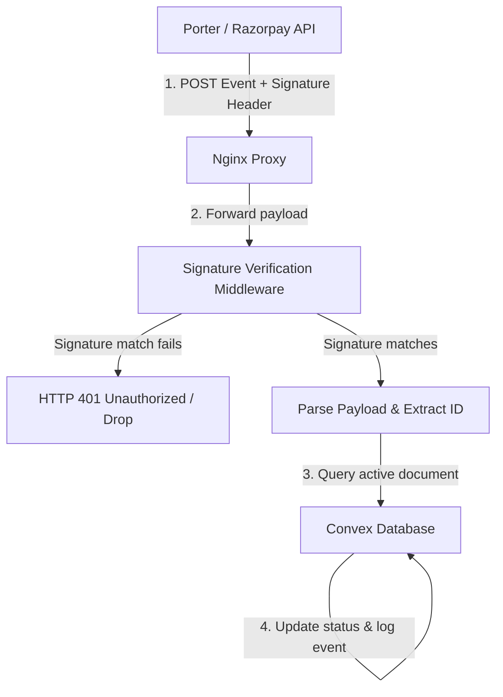

# Hive API Gateway - Webhook Integrations

This document describes how the Hive API Gateway receives, verifies, and dispatches asynchronous callback webhooks from Porter and Razorpay.

---

## 1. Webhook Architecture

Webhooks are public endpoints exposed to the internet. Because they lack standard token authorization, they must verify incoming signatures to prevent spoofing.



---

## 2. Porter Webhooks

Used to track delivery driver movements and transit changes in real-time.

* **Path**: `/v1/webhooks/porter`
* **Signature Header**: `x-api-key`
* **Convex Target**: `convex/webhooks/porter.ts`

### Webhook Verification Code:
The Porter signature is verified by comparing the `x-api-key` header value with the server's environment config:
```javascript
const signature = req.headers['x-api-key'];
const secret = process.env.PORTER_WEBHOOK_SECRET;

if (!signature || signature !== secret) {
  return res.status(401).json({ error: "Invalid signature" });
}
```

### Event Mappings:
| Porter Event | Gateway Action | Convex Database Field |
| :--- | :--- | :--- |
| `order_accepted` | Map Status | `status: "pickup_scheduled"` |
| `order_start_trip` | Map Status | `status: "in_transit"` |
| `order_end_job` | Map Status | `status: "delivered"` |

---

## 3. Razorpay Webhooks

Razorpay webhooks notify Hive of payment captures and failures, chargebacks, and seller (Route linked account) KYC status.

* **URL to register in the Razorpay dashboard**: `https://standing-mosquito-377.convex.site/webhooks/razorpay`
  (Convex HTTP action `convex/webhooks/razorpay.ts`; it verifies the signature itself, so no proxy is needed)
* **Secret**: the webhook secret set in the Razorpay dashboard must equal the prod Convex env var `RAZORPAY_WEBHOOK_SECRET`. Without it every event is rejected with 401.
* **Signature Header**: `x-razorpay-signature`
* **Events to enable**:
  * `payment.captured`, `payment.failed` — place the order if the browser never confirmed, check the captured amount, record Razorpay's fee
  * `payment.dispute.created`, `payment.dispute.under_review`, `payment.dispute.action_required`, `payment.dispute.won`, `payment.dispute.lost`, `payment.dispute.closed` — freeze / release / reverse the seller payout
  * `account.activated`, `account.instantly_activated`, `account.activated_kyc_pending`, `account.under_review`, `account.needs_clarification`, `account.rejected`, `account.suspended` — mirror seller KYC onto the boutique

The older `https://api.hivenow.in/api/webhooks/razorpay-route` endpoint lives only on the Express proxy server (its source is not in this repo) and is not needed once the Convex URL above is registered.

### Webhook Cryptographic Verification:
The Convex handler hashes the raw body with `RAZORPAY_WEBHOOK_SECRET` (HMAC SHA256) and compares it with `x-razorpay-signature`. A mismatch returns 401. Event ids are recorded in `webhookEvents`, so a repeated or retried event is processed once; there is no age limit, because Razorpay retries for up to 24 hours with the original timestamp.

### Seller KYC Event Mappings:
| Razorpay Event | `kycStatus` | `razorpayAccountStatus` |
| :--- | :--- | :--- |
| `account.activated` / `account.instantly_activated` | `activated` | `active` |
| `account.activated_kyc_pending` | `under_review` | `active` |
| `account.under_review` | `under_review` | `created` |
| `account.needs_clarification` / `account.rejected` | `needs_clarification` | `needs_attention` |
| `account.suspended` | unchanged | `suspended` |

---

## 4. Retries & Webhook Failures

### Partner Retries:
* Razorpay and Porter retrying rules are managed on their respective partner dashboards. They attempt back-off retries for failed delivery requests (up to 24 hours).
* To prevent timeouts causing retry cascades, the Hive API Gateway immediately acknowledges webhook receipts with an `HTTP 200 OK` response *before* executing complex long-running operations.

### Idempotency:
* If Convex receives duplicate pings for an event that has already been processed (e.g. an order is already marked `delivered`), the query is ignored, preventing duplicate settlements.
